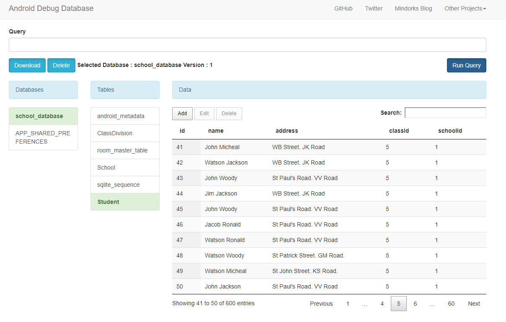

# Android Jetpack Room: Demo App with db viewer
 
Based on [Room Structure Tutorial](http://thoughtnerds.com/2018/02/android-room-persistence-library-database-tutorial/) and [Room Join Tutorial](http://thoughtnerds.com/2018/02/join-queries-room-persistence-library/)

Also with help of [Android Code Labs](https://codelabs.developers.google.com/codelabs/android-room-with-a-view-kotlin)

https://github.com/amitshekhariitbhu/Android-Debug-Database

## Viewing the Database in Browser

